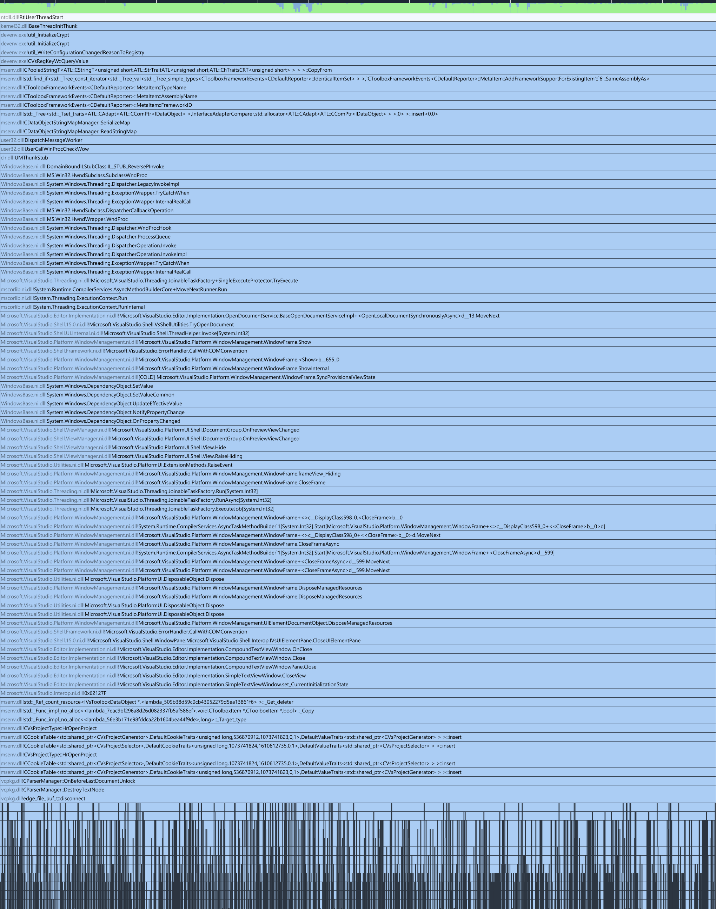

I have been waiting for Visual Studio 2022 to unfreeze for the last 30min, and now you get to read about it.

Curiously, this freeze has appeared more or less spontaneously after I opened a solution, then attempted to search for a thing in the codebase.

Here is what we're waiting for. For a moment I considered turning one of my monitors by 90° to capture the entire callstack, but I opted for some screenshot surgery instead:

I would love to tell you that this is the deepest callstack I have ever had to deal with, but truthfully, this doesn't even make the top 10000. In the age of async and callbacks, this sort of stack is just another Thursday, really.

I fully appreciate that some of the names in the callstack might be incorrect: sometimes multiple functions get folded into one ("ComDat folding", [thank you, FORTRAN](https://devblogs.microsoft.com/oldnewthing/20161024-00/?p=94575)) and they then get a common name. With that caveat, let's just go an walk this stack a bit!

We can safely ignore the first few frames: they are probably misnamed (e.g. the CopyFrom). But then we get to std::find_if, which takes a predicate. Apparently, this predicate is looking for some metadata, which it seemingly can't find, so we deserialize a file to get it. 
This deserialization then sends a message to a window in the process. I'm not sure why, but it looks like it wants to show a progress bar or some other window? In any case, this then goes through 13 frames to decide to kick off an async task. 
Before we get to the async task, let's just appreciate that these 13 frames include one of my favorite terms in computing terminology: The "ReversePInvoke." It sounds so sophisticated and clever but really just means "native code calls C# code." 
The async task needs a bit of machinery, so that's another 5 frames, and then we get to the actual work in the OpenDocumentService, which wants to open a document and show a window frame, presumably for that document.

But wait! We first have to Sync the provisional view state, and that involves setting a value on a dependency object, and that setter invokes an observer that someone has registered. That observer raises a "Hide" event, and a callback handles that to close a window frame.
Is that the same window frame we just opened? I do not know and never will. But whatever is doing the closing is an async procedure, which means we're going through a TaskFactory, which then goes through 7 more steps of calling generated code to execute that async procedure.
The async procedure then disposes an object, suitably called a DisposableObject, which here probably really means that it cleans up the window frame we're closing. (Synchronously, as it seems.)
This disposing calls an OnClose callback on a CompoundTextViewWindow, which in turn closes a SimpleTextViewWindow. This triggers an update of the CurrentInitializationState, which decreases the ref-coiunt on some shared pointer.
This causes the ref-count to drop to zero, so we're now calling a deletion callback. Then the track gets muddy: it claims to be opening a project, but I'm not sure I trust that. On the up-side, we get to observe several calls into a cookie table, yum.

Finally, a ParserManager has now gotten the note that we're deserializing metadata, err, opening a document, or rather are opening a window, no I mean syncing the provisional view state and then update a preview, then close a window, or maybe open a new project. Maybe.
In any case, the ParserManager needs to do some work before it "unlocks the last document", and it destroys some text. This involves multiple queries to the file systems (msvc::stat), various round-trips between UTF16 and UTF8, and updating some text image cache repeatedly.

Writing posts like this takes time. This is not a segway into a pitch for my Patreon or something, but an opportunity to tell you that VS2022 is still stuck and I am now putting it out of its mysery; no program should have to suffer for more than an hour.
I don't think a single programmer is to blame for this. Part of this is surely "it's an old and large piece of software", yet I believe that you are much less likely to end up in this state if you don't have callbacks everywhere.

(Let me also point out that I don't think the problem is that "Microsoft bad" or "people working on VS are stupid." No, they are probably just as irritated as I am, except that they can maybe also tell the familiar story of how software gets to this point.)