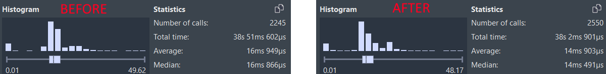

I have already introduced my latest project `cpp2better` in a [previous post](). I have made good progress and wanted to share some results.

I have had the chance to test my tool on more projects now and can report some more results. Here is a proof of the speed-up in one game on PS5:

That's 1.89ms per frame. Here is another game, again on PS5:

That's just about 2ms on average. Another game on PC reports speed-ups in the range of 10%-15%. I am sure that not all games are going to see the same amount of speed-up, and `cpp2better` can only help you if you are CPU-bound of course, but all of this is very encouraging.

The technical term for getting 2ms per frame by adding a tool to your build process is ~~this is nuts~~ "optimization at the speed of 1.6 Kilo-Fredriksson." One Fredriksson is 0.1ms per week (yes, you can cancel those units, and no, I won't). Adding a tool to your build process takes 30min. At five working days of 8h, this puts one Fredriksson at 0.1ms per 40h, or 0.0025ms / h. We are moving at 2ms per half hour, or 4ms/h, which then makes this 1600 Fredrikssons[^fredriksson].

Thank you for bearing with me while I write about in-jokes, but the point is that you can make (some?) IL2CPP games run faster with very little work on your end.

One of the learnings from this adventure so far has been that Unity does not use LTO on Android and iOS. It is just flat-out disabled on iOS, and while there seems to be some effort to use LTO on Android I do not see that actually happen, even in cases where it apparently should use LTO. Thank you to my friend Igor for finding and testing this (check out [their game Florisium here](https://x.com/florisium)). I have reported this as a defect to Unity, but let's just say I can see how a tool like mine would help fix some of the most glaring issues with lack of LTO.

I have more optimizations planned. Please reach out via e-mail if your studio wants to give it a try. I am also very interested in hearing from you if for some reason you cannot use IL2CPP's "Faster runtime" option and need to use "Faster (smaller) builds", as I have more ideas for how to optimize the performance of the latter. Any other IL2CPP problems like "we can't use X because the platform's linker crashes when we do that" are also welcome, I am morbidly curious after some of the things I have heard recently.

[^fredriksson]: I am semi-joking about the Fredrikssons. It's an in-joke I vaguely remember hearing about second hand, and it represents what you might expect a world-leading performance expert to achieve if you have already stopped doing the obviously stupid stuff. The "0.1ms per week" is just a guess, because I think it's fun to say "Kilo-Fredriksson." Also, relatedly, I have started to sponsor Andreas Fredriksson's development on [the Tundra build system](https://github.com/deplinenoise/tundra).