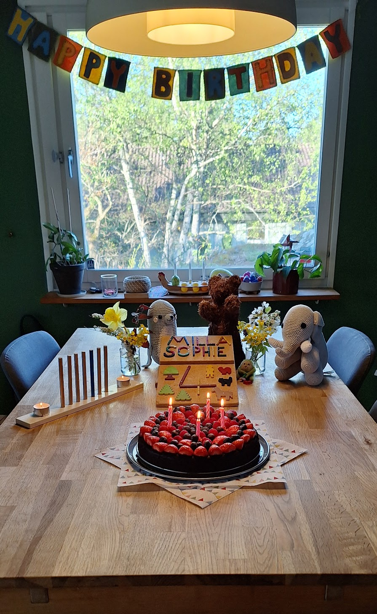

Today is my daughter's fourth birthday. I have already previously written a few words about [how parenting has changed me](), and I want to continue with that today. One thing that changed recently is that my perspective on birthdays has changed, in a subtle way: Growing up as a kid in Germany, it was pretty clear that birthdays are about the kid themselves: they have a day, once per year, that is a celebration _of them_.

This year I am reminded of a common German birthday tune with a line translating roughly to "it's great that you've been born, we would have missed you otherwise," and this year I can maybe truly feel that for the first time: there is enough of a history now to have survived the initial impact of parenthood. So this year for the first time I came to the conclusion that we don't celebrate my daughter's birthday _for her_, but we celebrate it _for us_. It's a subtle shift, and of course I still (like everyday) do my utmost so she has the best time possible, but we don't just celebrate her. We celebrate our time together more than anything, and it's an opportunity to look at how much me and my partner have grown through her, and how much smaller we'd be (in all regards but actual size), if it wasn't for her. It's not just about _her_, it about her and her incredibly positive impact on everyone and everything else.

It's a reminder that the people insisting on calling you on _your_ birthday are not just following their facebook reminders but recall their history with you[^call], and that I should reiterate to my parents that they are always welcome on my birthday. They probably know, but it surely won't hurt to spell it out again.

I have not yet found anything that compares to parenting, even remotely, in the amount of growth it requires:
 * Your patience will be tested, again and again, and if you lose it, _it will all get worse_.
 * All your worst behaviors will be reflected back to you, until you overcome them.
 * You will repeatedly be thrown into situations that bring you on the verge of nervous breakdown, and giving in to any of your non-constructive impulses will immediately lead to regret.
 * Unconditional love is the only useful answer, in almost every situation.

When someone says stuff like "this company is their baby", I struggle to see how that could ever be true. Yes, maybe it keeps them up at night. Yes, maybe it's important to them. But do you know what you can do with a company? Shut it down. Stop it, admit defeat, move on to something else, get a job again. That does not work with kids. The only way is forward, always, and either you learn to do that, or _everyone_ will have a terrible time[^forward]. That is the outcome sometimes, unfortunately, and I am still too early into into this journey to give any more definitive answers, and I am far from perfect... but compared to where I was four years ago? Miles ahead, and at least I know some more of my blindspots now.

Happy birthday, Milla. Thank you for four years, and too many many more. I hope you enjoy the cake I made for you.

[^call]: As a millenial I am required by law to remind everyone that calling people is generally reserved for emergencies, stick to text otherwise.

[^forward]: Maybe the key to running a successful company is to approach it with the same mindset. I applaud anyone who manages to do that without the experience of having children.