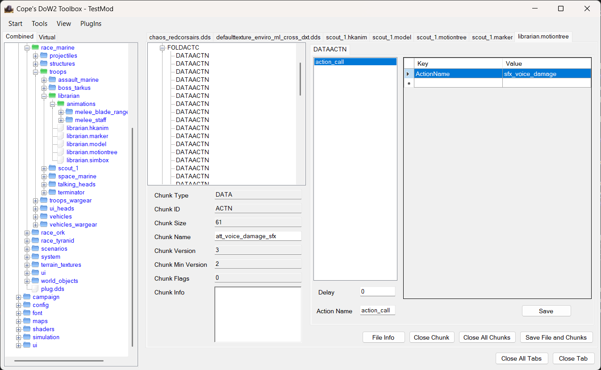

Recently I got a message from someone that ran into a performance problem with a tool I wrote 15 years ago. On shutdown, the program would completely grind the entire machine to a halt for 3 minutes. Was I able to help them? A little bit, I think: We had joint call, profiled a bit, dug up the source code, figured out how to build it, and collected some ideas of what to try. My diagnosis of the performance problem is "deeply nested WinForm treeviews are much worse on WoW64 than on x86 Windows." It was a fun issue to diagnose: I first thought that it might be a memory issue, since you can get this system-wide slow grind-to-a-halt when under memory pressure everything suddenly runs into page-faults everywhere. This case however was different, since I noticed that the videocall we had did not start to stutter, but the rest of the dekstop did! It turns out that being very slow in the Windows message pump wrecks the entire system's usability, and for some reason destroying a deeply nested treeview involved some surprisingly slow WoW64 emulation codepaths in message handling code.

More than a fun little performance adventure, this was a fun excursion into things I did as a teenager. Let's take a trip down memory lane.

My answer to the question of "Amiga or Atari?" is a blank stare, followed by a slow shrug, because I am too young to have experienced either of them. Born in 1992, the first games I remember playing were Police/Space Quest (way too hard for small kids), Sokoban, Prince of Persia (how were my parents OK with that amount of blood?), and a weird pink game with a cat (apparently called "Alley Cat"), all on my father's Windows 3.1 laptop. I did not grow up with the experience of slowly and methodically copying source code from magazines to play a new game. No, the games I played as a kid were way too high-tech for that already: I loved SimCity 2000, SimPark, an assortment of Lego games (RockRaiders being a favorite), Jazz Jackrabbit 2, Zoo Tycoon, Age of Empires 2, Stronghold, Anno 1602, and The Patrician 2. Later, I loved RTS and in particular anything that Relic put out: Dawn of War 1 was a revelation (and my mother would never have allowed it if she had actually known about the amount of blood in the game), and Company of Heroes is probably the crown-jewel of all of 2000 RTS. I recall the incredible experience during the beta, and the frustration when my GPU died on the first night.

All of this is to say that if you grew up playing these games and were then trying to make your own games in the early 2000s, you were set up for disappointment. There is no way a 10 year old had any chance of copying a bunch of code from a magazine and end up with anything they would not consider a long-winded insult. "THAT is not a game." Instead, hundreds of hours were spent in scenario editors, world builders, level creation kits, or just in singleplayer with copious cheat usage to approximate the level of control you experience when building a game. It must have been 2002 or 2003 when I learned to program in "BlitzBasic" (from a book by [René Meyer](http://www.schreibfabrik.de/)). I did not create any meaningful games in BlitzBasic. I also recall working through a book for game programming using DirectX and C++ at the same time. I have no recollection of how (and whether!) I got anything to work in that space at all, though I do know that I never got to "the good bits" and essentially gave up on the later parts of the book.

The first environment in which I felt that I was able to actually "create" something was 2004's mouthful "The Lord of the Rings: The Battle for Middle Earth" (BME), which I (almost) got for Christmas in 2004. Almost, because it was late and the thing my parents bought off eBay was actually an illegal copy in Thai language. Years later, the eBay scammer they bought from was arrested; he did that at scale, apparently. BME was built on the SAGE engine, which also powered CnC: Generals, and was mostly configurable via text files. Playing around with making Gandalf even more powerful and letting him sweep entire hordes off enemies of the screen was just the best.

Since that game, every game I played became an exercise of "can I take this apart and change it?" I have probably spent more time modding video games than playing them. At first, it was just about modifying text files in BME. Then for the next game you actually need a specific tool to edit the files. Then for the next game, there is no tool, but apparently hex editors are a thing you can use for that. And the next game has a scripting system, so it's time to learn LUA. Then the next game crashes in weird ways when you change this one value, so maybe you learn to read logs.

The games that I spent the most time modding were Company of Heroes (CoH) and Dawn of War 2 (DoW2). The former already had a modding tool, the latter did not. It is hard to convey how much I learned from these games: I needed to learn more LUA to mod Company of Heroes. I needed to learn C# to create modding tools for DoW2. I had to learn how to reverse engineer file formats from scratch to figure out whatever those games were made of. I repeatedly hit walls of what I could do with the modding tools, so it was time to understand how these games are built: what are all of those DLLs anyway, and can I call their exports directly? Oh no, it's crashing in random places. How do I debug this? Ah, there is no source code available, but apparently I just need to learn to read a lot of assembly and make sense of it quickly. Oh great, I can't change the problematic bits anyway. Guess I need to learn how to write a thing that patches things in memory. Wait, how do I even run anything in that process? What's DLL injection and how do I do that? And do I need to learn C++ to actually productively work with Win32? Now, can I maybe boot up a C# runtime in the target? Oh cool, yes! How do I call C# functions from LUA? etc. -- It's a long chain of realizing that [there is no magic](), and you can figure it all out if you have the time. And teenagers have a lot of time, as it turns out!

This above is a screenshot from one of the many tools I built. It mimicks what [Peter Cawley](https://www.corsix.org/) did for CoH, except for DoW2. It loads modules from the game, parses their archive files, "virtually" overlays them over a local file system, and then allows you take one of the files from the virtual original archives and make local edits to them. There are a bunch of different tools for editing the proprietary binary files that drive the simulation in particular, but also a plugin system for handling different file types. The API for that plugin system was public, and the second release I made immediately broke the API and that killed off the single plugin that someone else made. I still feel bad about that now, and I am also very sorry about the UML diagrams that I insisted on providing: I did not know any better. One particularly noteworthy aspect is that the tool has an "advanced debug mode" that runs the game with your mod but also injects a DLL, then uses inter-process communication to allow you to hot-reload game data without restarting the game. When I was uploading the source code, I also found that I had started work on a user-mode debugger as part of this project before losing interest because modding also means that game updates break your work every few months.

One particular non-technical learning from my years of modding is that creating tools is fun, maybe more fun than making games. It's fun to solve your own problems. It's fun to solve someone else's problems, and it's extra-fun when nobody else even wants to touch the problem ("but I don't know C++!", "but we don't have the code!", "but it's in assembly!", "but that would take months!"). It's fun to give someone else a tool they could not have created, and then they come back with something that _you_ could not have created yourself with that tool. And maybe they smile and love their work, and you helped them do that. Video game developers are particularly passionate about their creations, and that makes creating tools for them all the more satisfying. _That_ is what making tools is about. And sometimes people reach out to you 15 years later, because they still use your tools, and entire communities only still exist because you made that tool. ([Again!]())

It is of course a little bit sad that the particular experience of modding games like I did probably died with the advent of UGC and online games that don't allow modifications anywhere... but honestly, I also turned out ~~just fine~~ ~~without major flaws~~ with only a triple digit number of major flaws, even though I did not have to copy my games letter-by-letter into a terminal before I could play them. Would I have been a better programmer if I had that sort of upbringing? How would I know! Nowadays, kids grow up with wide access to game creation: Unity, Roblox, Fortnite, etc. -- incidentally mostly created by the folks who are 10-20 years older than me. Yes, it's easier now. But that won't stop the curious kids, and they will learn so many things that I never got to because the ground work too so much more time. I can't wait to see what they end up creating.
