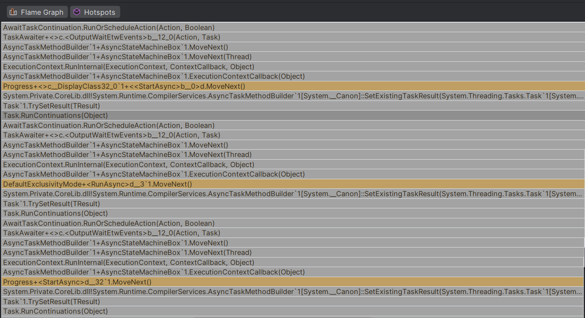

Over the past years, I have written async code on Windows with both C++ and C#. Compared to C#, the C++ side is poorly documented, full of landmines, and just generally requires a good bit of experience and caution to handle. For a taste, you can scroll through [this piece I wrote in 2024](). C# makes async programming much, much more accessible. Here's a sample [from MSDN](https://learn.microsoft.com/en-us/dotnet/csharp/asynchronous-programming/using-async-for-file-access):
```csharp
public async Task SimpleWriteAsync()
{
    string filePath = "simple.txt";
    string text = $"Hello World";

    await File.WriteAllTextAsync(filePath, text);
}
```

Isn't that great? Yes, it isn't. In my experience, it is not universally a good idea to remove friction. Sometimes, the right answer is to *add* friction, so people *don't* do something (and people hate intentional friction, as I recall from the responses [to this piece]() I wrote a while ago).

I have observed this: I am much more likely to write async code in C# than anywhere else. I likewise see that in much of the C# code written by others that I encounter nowadays.


Making things async is "free performance" and obviously good, right? Uh-oh. I have to constantly remind myself that that's not true.

### Free "performance"
First, the "performance" in "free performance:" Yes, you can probably get better (insert your metric here) by using asynchronous operations. I have no doubts that everything-async is often a fantastic win server-side, for example. But what about reading a file asynchronously in a command-line app, while your app is not doing anything else but waiting for that read?

"But I would never do that!" Fantastic! But rest assured, that's happening, I'm seeing it. Not because anyone intended for this. It is more likely because some function was already marked `async` (e.g. `MyFile.ReadThing`), because it was easy to make it async "in case it is ever needed." So then the caller awaited its result, because otherwise we'd block and that's a bad thing to do: someone made that function we call `async` afterall! So now the calling function is also `async`.

Consciously deciding to instead block and wait on the result of the async operation is going against the common wisdom of "how to write good code." Just hear it [from MSDN](https://learn.microsoft.com/en-us/dotnet/csharp/asynchronous-programming/async-scenarios#synchronous-access-to-asynchronous-operations):

> Synchronous blocking on asynchronous operations can lead to deadlocks and should be avoided whenever possible. The preferred solution is to use `async`/`await` throughout your call stack.

I am not saying this advice is *wrong*. They are right: If you make everything asychronous, you have to spend more time dealing with all the things that can go wrong in highly asynchronous programs. That's why maybe it is not a great idea to set people down the path of making *everything* asynchronous. If you want to make pieces asynchronous, then maybe don't go with a pattern like `async`/`await` that colors your entire program and you know *exactly* when you can block.

If you do not want to await an `async` call and instead block on the result, you need a much higher level of understanding of what's actually going on and be sure that you are _not_ causing the problems that MSDN and common wisdom warns against. I am not opposed to higher levels of understanding (at least not in principle) but reality isn't shaped in a way where everyone (can afford to) constantly operate(s) with high levels of understanding of complex, asynchronous systems. Your IDE is probably also going to give you yellow squiggles of shame for not sticking to "best practices" even in cases where you _do_ know that you can avoid `await`[^stream]. So guess what happens in practice.

Just yesterday I both produced a deadlock by taking away an `await` _and_ found a case where `SomeStream.FlushAsync` did the moral equivalent of `Task.Run(() => stream.Flush())`.

### "Free" performance
Second, let's talk about the "free" in "free performance." The unfortunate reality is that `async` is not free. I am not even talking about runtime performance overhead in some scenarios. I am talking about the inherent complexity of async programming and the specific implementation in C#.

Let's try and profile such an async app in C#. Here's a short excerpt:


The callstack here is around 400 stackframes deep, with about 50 frames of useful work. The vast, vast majority is completely unrelated to the actual "business logic." You might say "but a specialized C# profiler is not going to have that problem!" Rider's profiler did not fare better here, except that it refuses to display callstacks this deep and made me go through all threads one-at-a-time to even find the relevant work. Every step of profiling such an application is pure misery. Rider has the decency to at least mark some things in different colors, and I count around 9 frames between the actual work here:



There's an off-chance that `Spectre.Console` is partially to blame for _these exact callstacks_, but deeply nested async callstacks are not specific to that library. Look, no Spectre, but the spectre of async still spooks (at least it's for a HTTP connection here, so the actual usage of async is actually justified):


OK, but surely Visual Studio is doing better. They have a specific Async Task mode in their profiler, and I have tried that as well. I am using the fresh-off-the-shelf VS 2026 Insider preview, which by the way really does startup super quickly (nice work!). The installation is still dreadfully slow. My 7s profiling session was followed by 4minutes of "Loading data". I almost killed it because I thought it was just stuck. Then I looked at all tasks to try and find the work I know is taking the time. I sorted by maximum duration, discarded a few tasks, but after a good ten minutes of looking I gave up because the vast majority of the data in the table looks like this:


And let me also expand some of the details in that above view for you:


Am I holding this wrong? Did I miss a step? Is this tool actually aware of the async machinery? Does this not work on .NET10? Or is this an education problem on my end? All of these are possible answers, but I am coming to this tool with the intention of understanding the performance of a program, not with the intention of finding an edge-case that I can use to prove a point.

The same issues come up during debugging when you look at callstacks. Calling async usage "free" is _very optimistic_. Maybe it's "free" if you never try debug or profile your program. I do, all of the time. Someone working in server-space might tell me that all of this is better served with telemetry from live-services. I can't speak to what makes sense in that space, but locally? No, we have better tools.

Profiling a program does two things for me: first, I can see whether something is obviously slow. That is harder if all the data I get is now 90% noise (on top of the question of how much you pay for that noise). Second, a good profiler (like the amazing [Superluminal](https://superluminal.eu/)) is an X-ray machine for program execution. Asynchronous programs are inherently harder to understand. That is why you let experts build them, and create specialized tooling to understand what your program is doing, or focus the asynchronicity on patterns that are easier to reason about ("I am going wide at this particular place"). The idiomatic async usage does the complete opposite, by infecting your entire callstack, even for parts that might just as well be synchronous.

As a side note, most of the criticism I level at `async` usage here also applies to LINQ. Would you rather see one loop in one file, or code that alternates between six levels of nested enumerators and one-line lambdas that make it impossible to see what your program is actually doing? Not what it *should* be doing, no, what it is *actually* doing. Here's the thing: writing code is _easy_. Debugging code and understanding large programs is _hard_. LINQ and `async` optimize for writing at the expense of making debugging *even harder*.

I wonder how many problems are actually hidden by copious usage of `async` and friends.

To wrap things up, let me clarify that I am not saying "nobody needs async programming." Of course we do. I am also not saying "if they had let me design `async`, it would have been so much better." No, I am saying:
 * `async` has a very low barrier to entry (because someone made highly effective design choices) and it has this shine of "everything gets faster with async, always prefer async" (including yellow shame squiggles in IDEs for calling synchronous methods),
 * yet `async` is not free as it makes it much harder to reason about your program (both because of how it is implemented and because highly asynchronous programs are just harder to understand in general),
 * using `async` everywhere can hence be counter-productive, and if the cost of running asynchronous programs had been reflected in the day-to-day practice of writing `async` functions, people would have been more likely to weight the benefit of making something async against its cost instead of going all-in,
 * and if there are great tools for debugging and profiling `async`-heavy C# programs, I haven't found them yet. Pointers appreciated.