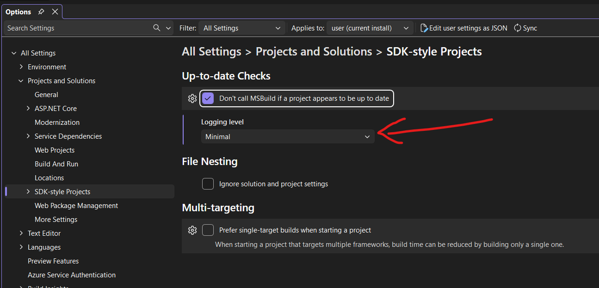
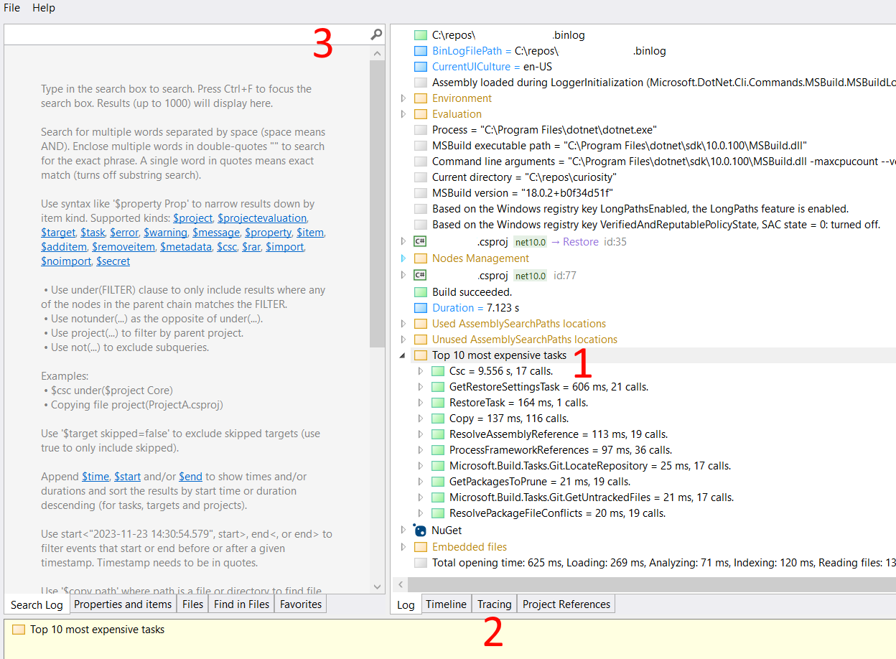
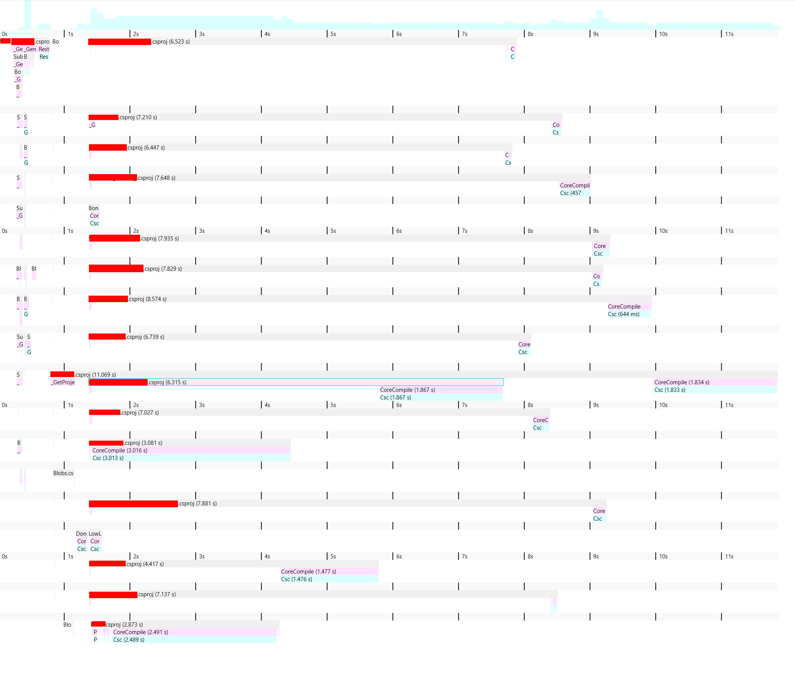
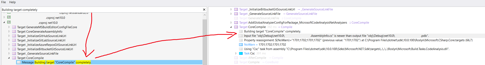

A friend recently joked that all my blog posts are to some level just trauma processing. He is not entirely wrong. Today's trauma is "why does it take 12s to recompile C# when nothing has changed?" I have found no good answers for google-queries like "how do I profile C# builds?" or "C# rebuild why." So today I'd like to first outline how to use msbuild logs to investigate that, and give you the root cause for my particular slowdown.

The first thing to note is that whether or not you see "slow builds" really depends on how you build your C# project. I have found that `dotnet run` and `dotnet build` might be slow, while building the same project through Visual Studio shows no slowness. In Visual Studio, there is a setting that can at least tell you *why* a project is rebuilding. You need to the the logging level for the `Up-to-date Checks` to at least `Minimal`. You can find that setting int `Tools/Options/Projects and Solutions/SDK-style Projects`. I have not found it helpful to go from `Minimal` to a higher logging level.



If you are using `dotnet run`, you need to go down another route. First, you need to let `dotnet run` or `dotnet build` know to produce a binary logfile:
```
dotnet run -bl:MyLog.binlog
```
`dotnet build` still uses MSBuild behind the scenes. The log is MSBuild's log, and it will show you how MSBuild has evaluated the build graph for the project.

Next, you need to get the [MSBuild Binary and Structured Log Viewer](https://msbuildlog.com/) by [Kirill Osenkov](https://mastodon.gamedev.place/deck/@KirillOsenkov@mastodon.social), who was also kind enough to give me a few pointers to solve my problem. You can now open the binlog file with that tool. The next screen is likely overwhelming, and I have found that you really need to know what you are looking for to make effective use of the tool. As a sidenote, I do not think that this overwhelm is the tool's fault: not all tools need to cater to casual users, and for experts it is probably great.

Let me show you three helpful places to look at:



1. On the right hand side in the log view, you can find a node `Top 10 most expensive tasks`. It shows you just that. In the concrete case here, you can see that we have spent 9.5s on Csc, which is C# compiler.
2. Near the bottom you can find a tab labeled `Tracing`. The tracing view is very useful for getting a quick overview. You would think that the timeline view would also be helpful, but I have honestly little idea what I am looking at with that view. In the concrete example here, you can see that we compile one project, which the requires a whole bunch of its dependencies to also be compiled. Most of these dependencies cannot compile in parallel (the `CoreCompile` bars do not overlap) because we seem to have a pretty deep tree of dependencies.

3. In the top left, you can find a search window. The search window is apparently very powerful, but we are just going to make very basic use of it. If you scroll down in the search window, you can find a lot of explanations and examples, but again if you don't know what you are looking for, they won't help. The magic query is `Building target completely`. This will show you all targets that MSBuild actually built (instead of skipping them, because it detected that nothing changed). You can use this to find the compilation targets that run:


Note how next to the compilation target, it say `Input file ABC is newer than output file XYZ`. This is MSBuild's detection for whether it needs to rebuild something because the inputs are more recent than the outputs. At this point, we are almost done: Take the file path of the input file and put it into the search box, and you will find the target in the graph that updated the file and caused a rebuild. Repeat if necessary.

Now back to the concrete problem I had: I occasionally saw very long build times (30s) when I made tiny changes to my C# program. I was able to create a reproduction scenario, where changing one line in the program would cause 12s rebuilds using `dotnet run` (instead of 2s, when nothing changed). The tracing view above shows that changing something in that one project at the root would recompile all of its dependencies, hence the long build times.

Using the approach above, I figured out that the `Project.AssemblyInfo.cs` file changed for every project. It turns out that my reproduction scenario involved switching between two commits (for automation purposes), and each assembly has the current git commit hash in one of its assembly-level attributes. Changing between commits therefore requires a full rebuild of everything. Whoops. This has been the case since NET8.0 (see [this GitHub issue](https://github.com/dotnet/sdk/issues/37027) and [this change note](https://learn.microsoft.com/en-us/dotnet/core/compatibility/sdk/8.0/source-link)). We can debate on whether this is useful default behavior, but for my purposes I turned it off by adding this to my projects:
```csharp
    <IncludeSourceRevisionInInformationalVersion>false</IncludeSourceRevisionInInformationalVersion>
    <EnableSourceLink>false</EnableSourceLink>
```
It's worth noting that you have to add this fairly late in the project, because something else resets those values. Putting them into `Directory.Build.props` is insufficient, but `Directory.Build.targets` works.