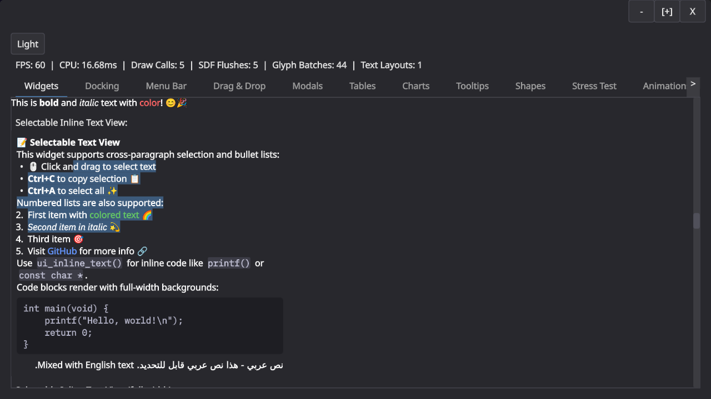
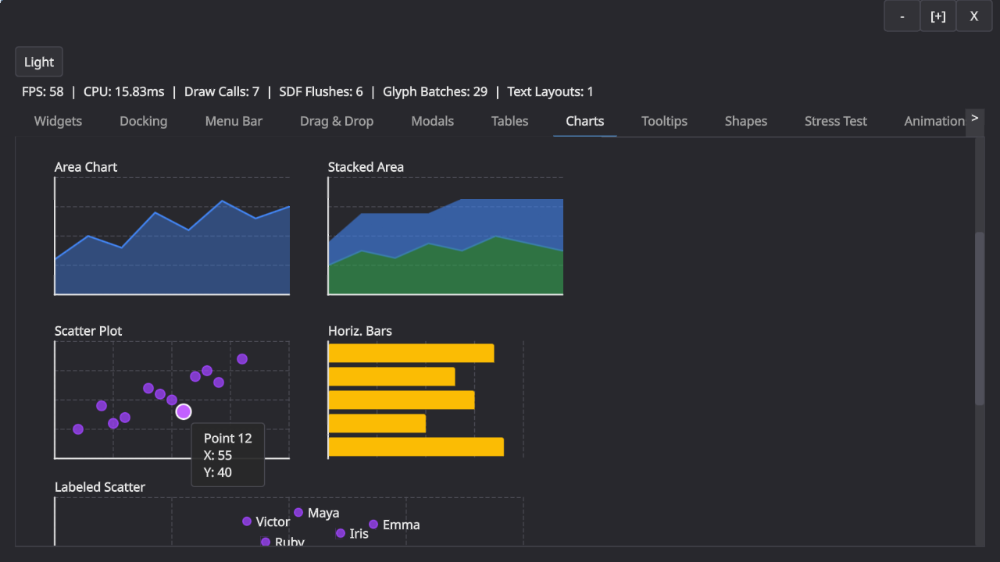
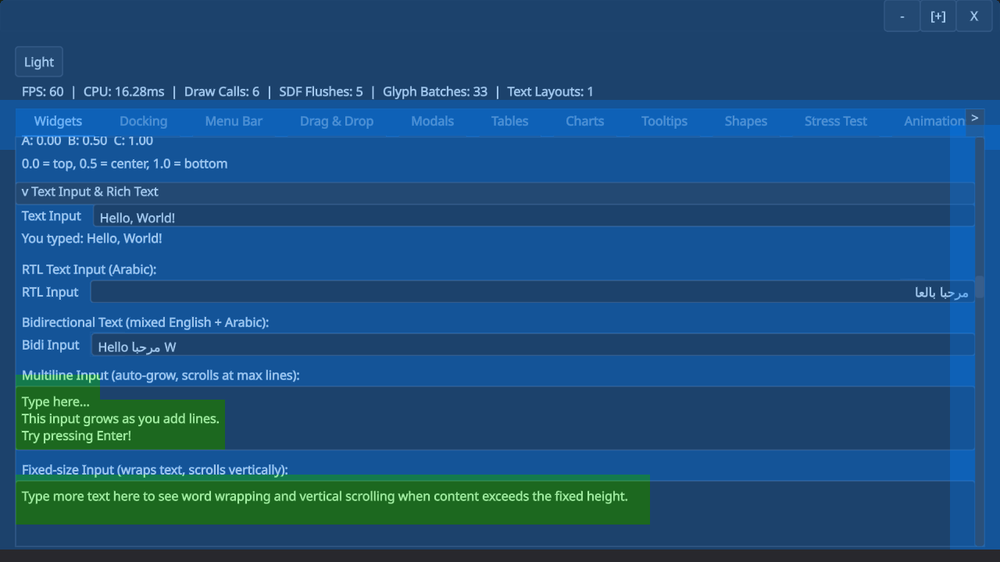
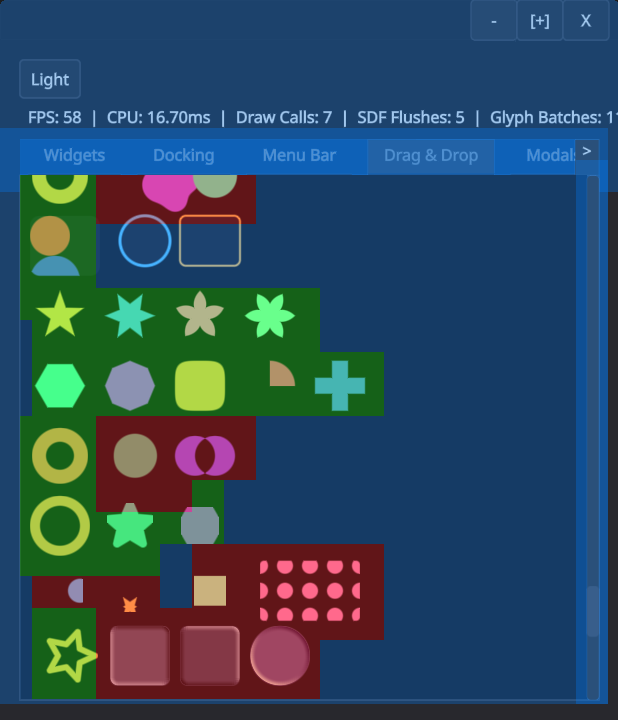

I have spent a lot of time recently on creating a GUI library. I have simply not found a library that satisfies my specific list of (partially subjective) requirements:
 * has a C interface,
 * looks reasonably good by default and allows to create things that actually look good,
 * compiles to WASM,
 * supports rich text and RTL,
 * has an immediate mode API,
 * is designed with accessibility in mind,
 * is built with UI testing and automation in mind.

Here is an obligatory screenshot that shows some of it. Note that there are still some RTL issues and that the buttons at the top are still placeholder-ish.

I was heavily inspired by [Ryan Fleury's posts](https://www.rfleury.com/p/ui-part-2-build-it-every-frame-immediate) on the topic but have since departed from his design in a few places. The main insight from Ryan's posts is the separation of drawing and interaction in an immediate mode API: The immediate mode API builds up a tree of boxes that you then later layout and draw. The interaction in the immediate mode API always use last frame's geometry, which makes a lot of sense because that is what the user actually perceived.

This part of the design has held up very well. We build a layout tree and then layer interactions and drawing on top of that. This leaves me with boxes (for layout), spots (for navigation and interaction), and shapes (for drawing) as the main primitives for building GUIs.

What have I learned from this adventure?

1. **Keyboard navigation is hard.** Super hard in fact. Tons of special cases. Should arrow keys move between navigation spots in screen space? Or by walking the layout tree? OK but what when you press down in a virtualized list, surely that should scroll? And do you want to be able to control the scrollbar with your arrow keys directly? Speaking of scroll containers, do you need to be able to skip them, assuming that "arrow down" scrolls the container? And is arrow navigation really the same as tabbing? (Tabbing to text field should start editing, but using "right arrow" to do the same thing probably shouldn't, because otherwise you are stuck in the text field?)? And what about modals and submenus? Do you correctly return to the right spot? Oh, and now someone clicks into a random part of the UI and you still need to reconstruct the navigation hierarchy, right? etc. -- it's a minefield, with tons of special cases, and if you get anything even slightly wrong, it will immediately be very annoying.

2. **Finding the right layer of abstraction is hard.** My initial architecture had concepts like "modulate fill color when you are hovered" plumbed all the way to through the entire library. I think the root-cause for this is that I initially started with a very monolithic design, where "boxes" did everything. This monolithic design turned out to be terrible. I essentially threw everything away when I realized I couldn't even answer questions like "how do you make a green button when using a blue UI theme?" \
\
Splitting the library up into reasonably self-contained components and layers that have no "vertical" concepts running through them was key here, e.g. the "shape" and "box" layers no longer know about styles: they render in exactly the colors and sizes you gave them. The controls layer on top does all modulation for interactions, and even that layer doesn't know about styles: every single button takes a config struct, and that config struct may or may not be derived from a style. Unsurprisingly, making everything *just data* is the simplest design.

3. **Tiled rendering is pretty neat!** While I have not really tried to really optimize the UI yet, it was important to get it into the right ballpark. A busy fullscreen UI at 4K should not take a noticeable time to render (certainly well below a millisecond!). In my case, the entire UI is SDF based: it emits a big command buffer (or more) and uses an interpreter in a shader to render it. A naive implementation scales as `O(commands * pixels)`, but with a tiled approach you can quickly collect the commands that can possibly affect a tile and cut that number down a lot.\
\
But why stop there? The main performance issue I hit was occupancy, because the interpreter shader is pretty complex and hence uses many registers. However, the vast majority of tiles use just a tiny portion of the interpreter. I ended up computing a complexity per tile to dispatch it to different shaders (blue is lowest, green is mid complexity, red is high). This was very effective.

The text input boxes here have mid-complexity because they need to go through an extra clipping step, for example. (I'm not a rendering engineer, but I figured it's useful to support both scissor rects and SDF clipping to be able to trade drawcalls for shader complexity. SDF clipping is mid-complexity.)
\
Here is another example with different kinds of shapes and operations. Note how circles and rounded rects use the simplest shader, whereas complex shapes or effects require the complicated shader.

There is much more that could probably be done very cheaply with a tiled renderer like this, e.g. only redrawing the parts of the UI that changed.

4. **Text is probably hard, but I get to ignore that.** I've been using Mikko Mononen's excellent [Skribidi](https://github.com/memononen/Skribidi) library, which has allowed me to ignore a lot of the complexity of text rendering. I only had to make very few changes to the library and it has generally be a joy to use. I ended up adding msdf support for shape rendering (but still need to deal with the performance problems that this created).
\
The only text-related difficulty that I struggled with was purely conceptual. Is text just a rendering shape? And how does text interact with spots for navigation and interactions? It took me a long time to sort this out in my head. I ended up treating text as a "layout mode", which allows you to mix text and regular layout boxes. Text then is a special kind of "inline" box which still supports shapes and spots, so that links are merely text with interaction, and a code block is just text with a background shape.

5. **Programming with AI is awesomeful.** I have used AI heavily to work on this library. The biggest upside of AI for me in this case was large scale refactoring: I had a handful of instances where it was clear that I can either live with my bad choices enshrined in hundreds of tests and a large demo, or I rewrite large parts of the API surface. I don't think I would have had the stamina to go from "everything is a box" to "there are shapes, spots, and boxes" -- at least not in the timeframe I have spent on this library (~1.5months). Cluade (and codex) made it very clear that they are not a fan of doing rote refactoring either: "This seems like a lot of work. I should ask the user whether we can stop now.".
\
This experience has also reinforced that we are still far away from fully replacing software engineers. I do not want to imagine the mess you would get by asking an agent to "write a immediate mode GUI library." Agents have no taste and no sense for large scale design (yet?). For something like keyboard navigation, you still need to painstakingly go through every single case to get the right behavior. There is no shortcut here.