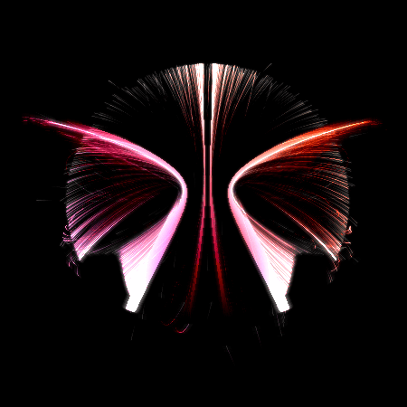

Welcome to my personal website!\\
\\
Read on to get a sense of what I do in my freetime\\
and what some of my favorite projects of the last few years are.\\
\\
[My Blog]() and [About Me]() page will tell you more about what I do.\\
\\
Write me an [e-mail](mailto:mail@s-schoener.com) or find more ways to contact me at the bottom of the page.

---

  

    
  

  

    <h4 style="text-align: left">
      <a href="http://kerntief.com">
        Block Machine, 2017/2018, ongoing
      </a>
    </h4>
    

    *Block Machine* is a difficult problem solving game in which your task is to build computers from blocks on a grid. Even though it is a programming game, it is unlike any programming language you have ever worked with: Everything is happening in parallel, code is data, control flow is implicit, and data movement is physical movement.\\
    \\
    -- *C#, Unity Engine*
    

  

---

  

    <h4 style="text-align: right">
      <a href="{{ "2018-02-03-music-data" | post_url }}">
        Exploring 65 years of music, 2017
      </a>
    </h4>
    

    This is a project from my nanodegree in Data Analysis at [Udacity](https://www.udacity.com). I take a close look at 65 years of music (as collected by MusicBrainz and Discogs) and provide some insight into the development of music genres, track lengths, and release formats among other things. It includes some pretty plots :)\\
    \\
    -- *R, dplyr*
    

  

  

    
  

---

  

    
  

  

    <h4 style="text-align: left">
      <a href="pages/variations-on-voronoi">
        Variations on Voronoi, 2016
      </a>
    </h4>
    

    *Variations on Voronoi* is a procedural art project I created in the Summer of 2016. It is an interactive toy based on a very simple algorithm to compute discrete Voronoi diagrams in pixel space. With the right parameters this creates astonishingly detailed pictures, generated pixel by pixel.\\
    \\
    -- *Java, Processing*
    

  

---

  

    <h4 style="text-align: right">
      <a href="http://www.kerntief.com">
        Patterna, 2016
      </a>
    </h4>
    

    *Patterna* is a very difficult logic puzzle game in the veins of HexCells. Its most prominent feature is a very customizable random level generator that creates high quality puzzles using a hand-optimized constraint solving library. It also features a wonderful soundtrack by my friend [Alex Cottrell](https://www.alex-cottrell.com).\\
    \\
    -- *C#, Unity*
    

  

  

    
  

---

  

    
  

  

    <h4 style="text-align: left">
      <a href="pages/gravvity">
        Gravvity, 2010
      </a>
    </h4>
    

    *Gravvity* is a generative art project I created in the summer of 2010. It lets users interactively create art by placing massive objects in space which then affect particles whose paths are traced over time. A crucial feature is that the user can always reset the canvas, which ensures that the same intial setup can lead to radically different results.\\
    \\
    -- *Java, Processing*
    

  

---

  

    <h4 style="text-align: right">
      <a href="https://www.easternfront.org"> 
        Company of Heroes: Eastern Front, 2010-2015
      </a>
    </h4>
    

    *Eastern Front* is an unofficial expansion to Relic Entertainment's 2006 game *Company of Heroes*. I worked on it as a programmer, pushing the boundaries of what was considered possible in CoH modding by fixing crashes and providing LUA scripting hooks for modders -- all in hand-written x86 assembler without source code access.\\
    \\
    -- *C/C++, LUA, x86 ASM*
    

  

  

    
  

---

  

    
  

  

    <h4 style="text-align: left">Modding Tools and Patches, 2007 - ongoing</h4>
    

    I have written modding tools and small patches for many games including *Cities: Skylines*, *Company of Heroes*, *Dawn of War 2*, *The Patrician 4*, and *Act of War*. I take particular pride in reverse engineering file formats, fixing crashes by debugging without source code, and empowering people more talented than me to create.\\
    \\
    -- *C#, C/C++, x86 ASM*
    

  

